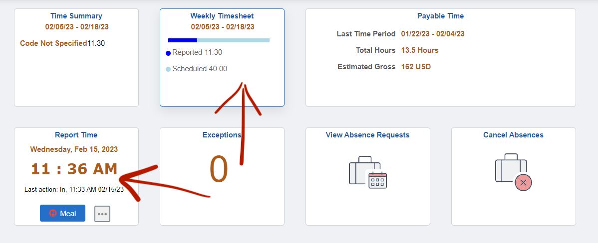

# 📋 Onboarding


The first thing you should do is bookmark this lab manual so you always have easy access to it and can return to it anytime you have a question about something.


### CITI Training

All researchers must have active Collaborative Institutional Training Initiative (CITI) training to interact with participants or assist in data collection and analysis. RAs are responsible for keeping their CITI training up to date. For our lab, you need to complete all the modules within the Group 2 Social / Behavioral Research Investigators and Key Personnel.

[See Instructions on how to complete the CITI Training](https://researchintegrity.gatech.edu/irb-required-training)

At the end, you should get a completion report that looks like the following. Send this completion report and your certification (see elsewhere in the .zip folder) to the lab manager or graduate student in charge of the IRB (i.e., Alex and/or Cody).

<figure><figcaption></figcaption></figure>

### Complete HR Paperwork

If you plan on working for pay there are several steps to get you hired through Georgia Tech Human Resources. Please complete any steps with HR (e.g., signing the I-9 form) as quickly as possible otherwise there may be a considerable delay in getting you hired, Georgia Tech HR is notoriously slow.

Note that if you have been hired for a job or position on campus before, then we do not need to go through human resources and the process to get you hired will be faster.

The person in the lab in charge of Hiring and Onboarding will send your hiring information to our finance staff Kaysha Chandler ([kaysha.corniffe@psych.gatech.edu](mailto:kaysha.corniffe@psych.gatech.edu)) and let you know what information they need.

At some point you will be contacted by HR to complete and/or sign some forms. It will be in your best interest to complete any of the steps requested by HR as soon as possible. One of the things you will need to sign in-person is the I-9 form. Delaying any of these steps will make the hiring process take longer and may lead to a significant delay in your payment.

If you have any questions about completing the hiring process, direct your questions to our finance staff Kaysha Chandler ([kaysha.corniffe@psych.gatech.edu](mailto:kaysha.corniffe@psych.gatech.edu)).

### Sign-up for Credit

If you plan on working for course credit you will choose one of 4 options listed below:

* PSYC 2699: credit for 1st and 2nd year students
* PSYC 4699: credit for 3rd and 4th year students
* NEUR 2699: credit for 1st and 2nd year NEUROSCIENCE students
* NEUR 4699: credit for 3rd and 4th year NEUROSCIENCE students

Once you have figured out which course you will be taking you will need to fill out a permit request form for the course. Dr. Engle will need to approve this first before you are able to register for the course. The request forms can be found here:

* PSYC courses: [Psychology Course Request](https://forms2.cos.gatech.edu/psych-course-request)
  * 2699 CRN: 21681
  * 4699 CRN: 23864
  * Professor: select Engle, Randall W
  * Permit Type: select PERMIT REQUIRED
* NEUR courses: [Neuro Course Request](https://forms2.cos.gatech.edu/undergraduate-research-permit)
  * Number of hours per week: type either 3, 6, 9, or 12 hours
  * Number of credits: corresponds with hours per week
    * 3 hours = 1 credit
    * 6 hours = 2 credits
    * 9 hours = 3 credits
    * 12 hours = 4 credits
  * Project Title: We will provide this to you for one of our current projects
  * Research Description: We will provide this to you as well
  * Faculty Name: Randall Engle
  * Faculty Email: [randall.engle@gatech.edu](mailto:randall.engle@gatech.edu)

Let us know when the request is sent and we will inform Dr. Engle so it is approved (usually takes around 24 hours). Once the request is filled register for the course as usual.

### OneUSG

If you are working for course credit, you can ignore this section. It only applies to RAs working for pay.

OneUSG is the system you will use to log your hours so that you can get paid. You will be paid every two weeks. Payments typically are sent out the week after a pay period ends.

Once you complete all the HR paperwork, you will eventually be added as a student assistant on OneUSG under our lab. **However, it can take a considerable amount of time for HR to process your paperwork and add you on OneUSG under our lab**. This means there will be a delay in your payment for the first month or two while we wait for HR to process your paperwork and get you into OneUSG.

When you first start working you will have to keep track of your hours - start and end times for each shift - on your own. When you are added onto OneUSG under our lab we will then ask you to send us your hours and we will get them retroactively submitted on OneUSG.

We have an #ra-payroll channel on Slack. If you are working for pay or Federal Work Study, then you need to make sure you are added to this Slack channel. Please check if you are or not. If you are not, then join the channel or request that the Lab Manager or Time Approver adds you to the channel.

### Clock-in and Clock-out

If you are working for pay or Federal Work Study you will need to clock-in and clock-out every shift using [OneUSG Connect](https://oneusgconnect.usg.edu/). Failing to keep track of your time may mean that your paycheck will not be correct. At the very least, it will create extra work for your supervisors and our office staff, who are already busy.

If you forget to clock-in or out or you notice your hours on your timesheet are not correct, then please let the Time Approver know as soon as possible.

This is what you should see when you login to OneUSG. Here you can access the **Report Time** clock feature and check on your **Weekly Timesheet** to make sure your hours are correct.

<figure><figcaption></figcaption></figure>

Questions and concerns about your timesheet can also be directed to Kaysha Chandler ([kaysha.corniffe@psych.gatech.edu](mailto:kaysha.corniffe@psych.gatech.edu)) or Sandra Wilson ([sandra.wilson@psych.gatech.edu](mailto:sandra.wilson@psych.gatech.edu)).

### Slack

We primarily use Slack for lab communications. [Join our Labs Slack Workspace](https://join.slack.com/t/englelab-gatech/signup) and make sure your settings are such that you are able to receive notifications from posts and direct messages.

### Website Profile

Send the [Website Manager](people.md) a photo and information about yourself to be added onto our [lab website](https://englelab.gatech.edu/people).

Send the following information:

* A profile photo of yourself
* Your major
* Class standing (e.g., sophmore)
* A short blurb about yourself, your interests related and even unrelated to the lab, and what your plans are for after graduation / career goals. [See current lab profiles as an example](https://englelab.gatech.edu/people.html#undergrads).
